<h1>📱Dasar State Management</h1>

| Nama | NIM | Kelas/Absen |
| --- | --- | --- |
| Alexander Agung Raya | 2341720040 | TI-3H / 01 |


### Praktikum 1: Mengunduh Data dari Web Service (API)

- Langkah 1: Buat Project Baru
    Buatlah sebuah project flutter baru dengan nama books di folder src week-11 repository GitHub Anda.

    Kemudian Tambahkan dependensi http dengan mengetik perintah berikut di terminal.
    ```bash
    flutter pub add http
    ```
- Langkah 2: Cek file pubspec.yaml
    Jika berhasil install plugin, pastikan plugin http telah ada di file pubspec ini seperti berikut.

    ```yaml
        dependencies:
        flutter:
            sdk: flutter
            http: ^1.1.0
    ```

    Jika Anda menggunakan macOS, Anda harus mengaktifkan fitur networking pada file macos/Runner/DebugProfile.entitlements dan macos/Runner/Release.entitlements dengan menambahkan kode berikut:

    ```xml
        <key>com.apple.security.network.client</key>
        <true/>
    ```

- Langkah 3: Buka file main.dart
    Soal 1
    Tambahkan nama panggilan Anda pada title app sebagai identitas hasil pekerjaan Anda.

    ```dart
       import 'dart:async';

        import 'package:flutter/material.dart';
        import 'package:http/http.dart' as http;

        void main() {
        runApp(const MyApp());
        }

        class MyApp extends StatelessWidget {
        const MyApp({super.key});

        @override
        widget build(BuildContext context) {
            return MaterialApp(
            title: 'Future Demo',
            theme: ThemeData(
                primarySwatch: Colors.blue,
                visualDensity: VisualDensity.adaptivePlatformDensity,
            ),
            home: const FuturePage(),
            );
        }
        }

        class FuturePage extends StatefulWidget {
        const FuturePage({super.key});

        @override
        State<FuturePage> createState() => _FuturePageState();
        }

        class _FuturePageState extends State<FuturePage> {
        String result = '';
        @override
        Widget build(BuildContext context) {
            return Scaffold(
            appBar: AppBar(
                title: const Text('Back from the Future'),
            ),
            body: Center(
                child: Column(children: [
                const Spacer(),
                ElevatedButton(
                    child: const Text('GO!'),
                    onPressed: () {},
                ),
                const Spacer(),
                Text(result),
                const Spacer(),
                const CircularProgressIndicator(),
                const Spacer(),
                ]),
            ),
            );
        }
        }
    ```

    >!
    > Tidak ada yang spesial dengan kode di main.dart tersebut. Perlu diperhatikan di kode tersebut terdapat widget CircularProgressIndicator yang akan menampilkan animasi berputar secara terus-menerus, itu pertanda bagus bahwa aplikasi Anda responsif (tidak freeze/lag). Ketika animasi terlihat berhenti, itu berarti UI menunggu proses lain sampai selesai.

- Langkah 4: Tambah method getData()
    Tambahkan method ini ke dalam class _FuturePageState yang berguna untuk mengambil data dari API Google Books.
    ```dart
        Future<String> getData() async {
            final response = await http.get(Uri.parse('https://www.googleapis.com/books/v1/volumes?q=isbn:9780132350884'));
            if (response.statusCode == 200) {
            return json.decode(response.body)['items'][0]['volumeInfo']['title'];
            } else {
            throw Exception('Failed to load data');
            }
        }
    ```

    
- Langkah 5: Tambah kode di ElevatedButton
    ```dart
        ElevatedButton(
        child: Text('GO!'),
        onPressed: (){
            setState(() {});
            getData()
            .then((value) {
            result = value.body.toString().substring(0, 450);
            setState(() {});
            }).catchError((_){
            result = 'An error occurred';
            setState(() {});
            });
        },
        ),
    ```

    Lakukan run aplikasi Flutter Anda. Anda akan melihat tampilan akhir seperti gambar berikut. Jika masih terdapat error, silakan diperbaiki hingga bisa running.

    ### Jawaban
    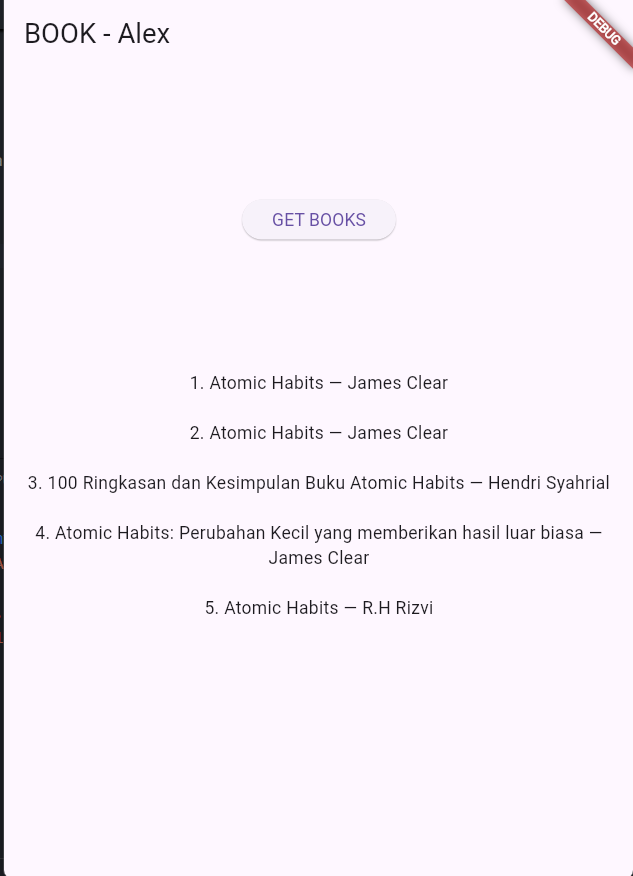

    Jelaskan maksud kode langkah 5 tersebut terkait substring dan catchError!
    
    #### Jawaban:
    - Substring: Substring adalah fungsi yang digunakan untuk mengambil bagian dari string. Substring dibuat dengan menggunakan tanda kurung kurawal (kurung kurawal adalah tanda kurung buka dan tanda kurung tutup) yang diikuti dengan angka yang akan diberikan sebagai parameter. Jika angka yang diberikan lebih besar dari panjang string, maka hasilnya adalah string yang sama dengan string asli. Jika angka yang diberikan lebih kecil dari panjang string, maka hasilnya adalah string yang berisi angka-angka tertentu dari string asli.
    - CatchError: CatchError adalah fungsi yang digunakan untuk menangkap error yang terjadi ketika kode yang dijalankan berhasil. Jika error terjadi, maka fungsi catchError akan dipanggil dan error akan dikirim ke fungsi tersebut. Fungsi catchError juga memiliki parameter yang bertipe Error, yang berisi informasi tentang error yang terjadi.

### Praktikum 2: Menggunakan await/async untuk menghindari callbacks

- Langkah 1: Buka file main.dart
    Tambahkan tiga method berisi kode seperti berikut di dalam class _FuturePageState.

    ```dart
        Future<int> returnOneAsync() async {
        await Future.delayed(const Duration(seconds: 3));
        return 1;
        }

        Future<int> returnTwoAsync() async {
        await Future.delayed(const Duration(seconds: 3));
        return 2;
        }

        Future<int> returnThreeAsync() async {
        await Future.delayed(const Duration(seconds: 3));
        return 3;
        }
    ```
    #### Jawaban:
    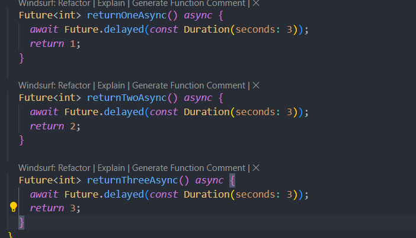
- Langkah 2: Tambah method count()
    Lalu tambahkan lagi method ini di bawah ketiga method sebelumnya.

    ```dart
        Future count() async {
        int total = 0;
        total = await returnOneAsync();
        total += await returnTwoAsync();
        total += await returnThreeAsync();
        setState(() {
            result = total.toString();
        });
        }
    ```

    #### Jawaban:
    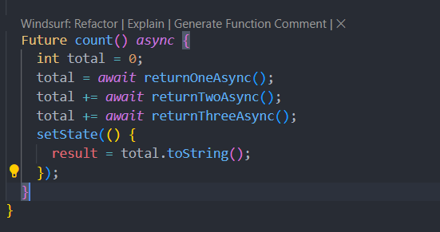

- Langkah 3: Panggil count()
    Lakukan comment kode sebelumnya, ubah isi kode onPressed() menjadi seperti berikut.

    ```dart
        ElevatedButton(
        child: Text('GO!'),
        onPressed: (){
            setState(() {});
            count()
            .then((value) {
            result = value.toString();
            setState(() {});
            }).catchError((_){
            result = 'An error occurred';
            setState(() {});
            });
        },
        ),
    ```

    #### Jawaban:
    

### Praktikum 3: Menggunakan Completer di Future

- Langkah 1: Buka main.dart
    Langkah 1: Buka main.dart

    ```dart
        import 'package:async/async.dart';
    ```

- Langkah 2: Tambahkan variabel dan method
    Tambahkan variabel late dan method di class _FuturePageState seperti ini.

    ```dart
        late Completer completer;

        Future getNumber() {
        completer = Completer<int>();
        calculate();
        return completer.future;
        }

        Future calculate() async {
        await Future.delayed(const Duration(seconds : 5));
        completer.complete(42);
        }
    ```

- Langkah 3: Ganti isi kode onPressed()
    Tambahkan kode berikut pada fungsi onPressed(). Kode sebelumnya bisa Anda comment.

    ```dart
            getNumber().then((value) {
        setState(() {
            result = value.toString();
        });
        });
    ```
    

- Langkah 4:
    Terakhir, run atau tekan F5 untuk melihat hasilnya jika memang belum running. Bisa juga lakukan hot restart jika aplikasi sudah running. Maka hasilnya akan seperti gambar berikut ini. Setelah 5 detik, maka angka 42 akan tampil.

    #### Jawaban:
    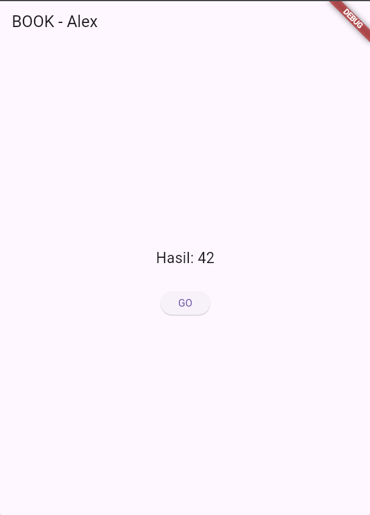

    Jelaskan maksud kode langkah 2 tersebut!
    - `late Completer completer;`
        Completer adalah objek yang digunakan untuk mengontrol sebuah Future secara manual — kamu yang menentukan kapan Future selesai (complete) atau gagal (completeError).
        late berarti variabelnya akan diinisialisasi nanti (tidak langsung saat dibuat).

    - `Future getNumber() { completer = Completer<int>(); calculate(); return completer.future;}`
        Membuat Completer<int> baru.

        Memanggil calculate() untuk mulai proses asynchronous.
        Mengembalikan Future milik completer (completer.future),
        yang akan selesai nanti setelah calculate() memanggil complete().

    - `Future calculate() async { await Future.delayed(const Duration(seconds : 5));completer.complete(42); }`
        Menunggu 5 detik.

        Setelah selesai, memanggil completer.complete(42),
        artinya Future yang tadi dikembalikan oleh getNumber() akan menyelesaikan dirinya dengan nilai 42.

- Langkah 5: Ganti method calculate()
    Gantilah isi code method calculate() seperti kode berikut, atau Anda dapat membuat calculate2()

    ```dart
        calculate() async {
        try {
            await new Future.delayed(const Duration(seconds : 5));
            completer.complete(42);
            // throw Exception();
        }
        catch (_) {
            completer.completeError({});
        }
        }
    ```

    ### Jawaban
    

    - Jelaskan maksud perbedaan kode langkah 2 dengan langkah 5-6 tersebut!
    - `try`
        try adalah blok kode yang akan dijalankan jika blok catch tidak terjadi.
    - `catch`
        catch adalah blok kode yang akan dijalankan jika blok try terjadi.
    - `throw`
        throw adalah fungsi yang digunakan untuk mengakibatkan exception.
    - `Exception`
        Exception adalah kelas yang digunakan untuk menghasilkan exception.

### Praktikum 4: Memanggil Future secara paralel

- Langkah 1: Buka file main.dart
    Tambahkan method ini ke dalam class _FuturePageState

    ```dart
        void returnFG() {
        FutureGroup<int> futureGroup = FutureGroup<int>();
        futureGroup.add(returnOneAsync());
        futureGroup.add(returnTwoAsync());
        futureGroup.add(returnThreeAsync());
        futureGroup.close();
        futureGroup.future.then((List<int> value) {
            int total = 0;
            for (var element in value) {
            total += element;
            }
            setState(() {
            result = total.toString();
            });
        });
        }
    ```

- Langkah 2: Edit onPressed()
    Anda bisa hapus atau comment kode sebelumnya, kemudian panggil method dari langkah 1 tersebut.

    ```dart
        onPressed: (){
            returnFG();
        }
    ```

- Langkah 3: Run
    Anda akan melihat hasilnya dalam 3 detik berupa angka 6 lebih cepat dibandingkan praktikum sebelumnya menunggu sampai 9 detik.

    #### Jawaban:
    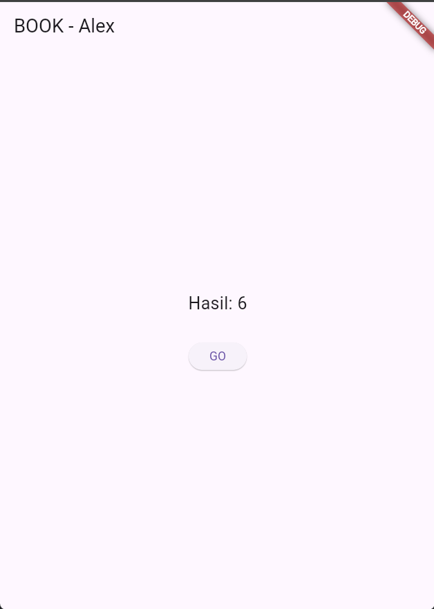

- Langkah 4: Ganti variabel futureGroup
    ```dart
        final futures = Future.wait<int>([
        returnOneAsync(),
        returnTwoAsync(),
        returnThreeAsync(),
        ]);
    ```
    
    Jelaskan maksud perbedaan kode langkah 1 dan 4!
    - `Future.wait`
        Future.wait adalah fungsi yang digunakan untuk mengambil daftar future dan mengembalikan hasilnya dalam satu future.
    - `returnOneAsync()`
        returnOneAsync() adalah fungsi yang mengembalikan future yang berisi angka 1.
    - `returnTwoAsync()`
        returnTwoAsync() adalah fungsi yang mengembalikan future yang berisi angka 2.
    - `returnThreeAsync()`
        returnThreeAsync() adalah fungsi yang mengembalikan future yang berisi angka 3.
    
### Praktikum 5: Menangani Respon Error pada Async Code

- Langkah 1: Buka file main.dart
    Tambahkan method ini ke dalam class _FuturePageState

    ```dart
        Future returnError() async {
            await Future.delayed(const Duration(seconds: 2));
            throw Exception('Something terrible happened!');
        }
    ```

- Langkah 2: ElevatedButton
    Ganti dengan kode berikut

    ```dart
        returnError()
        .then((value){
            setState(() {
            result = 'Success';
            });
        }).catchError((onError){
            setState(() {
            result = onError.toString();
            });
        }).whenComplete(() => print('Complete'));
    ```
- Langkah 3: Run
    Lakukan run dan klik tombol GO! maka akan menghasilkan seperti gambar berikut.

    #### Jawaban:
    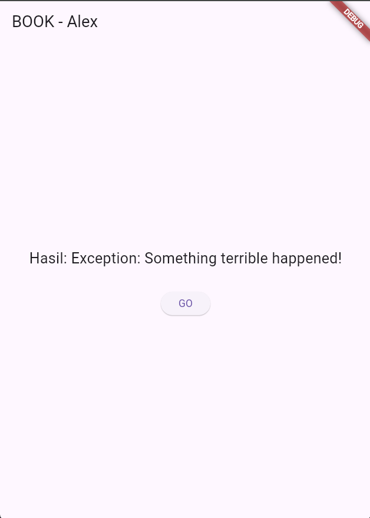


- Langkah 4: Tambah method handleError()
    Tambahkan kode ini di dalam class _FutureStatePage

    ```dart
        Future handleError() async {
        try {
            await returnError();
        }
        catch (error) {
            setState(() {
            result = error.toString();
            });
        }
        finally {
            print('Complete');
        }
        }
    ```

    #### Jawaban:
    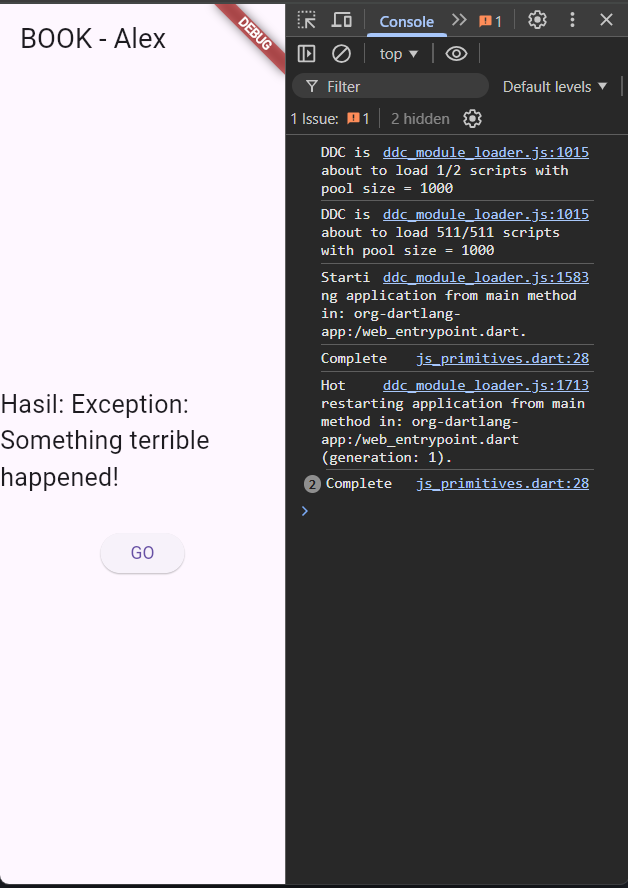

    Panggil method handleError() tersebut di ElevatedButton, lalu run. Apa hasilnya? Jelaskan perbedaan kode langkah 1 dan 4!
    - `try`
        try adalah blok kode yang akan dijalankan jika blok catch tidak terjadi.
    - `catch`
        catch adalah blok kode yang akan dijalankan jika blok try terjadi.
    - `throw`
        throw adalah fungsi yang digunakan untuk mengakibatkan exception.
    - `Exception`
        Exception adalah kelas yang digunakan untuk menghasilkan exception.

### Praktikum 6: Menggunakan Future dengan StatefulWidget

- Langkah 1: install plugin geolocator
    ```bash
        flutter pub add geolocator
    ```
- Langkah 2: Tambah permission GPS
    Jika Anda menargetkan untuk platform Android, maka tambahkan baris kode berikut di file android/app/src/main/androidmanifest.xml

    ```xml
        <uses-permission android:name="android.permission.ACCESS_FINE_LOCATION" />
        <uses-permission android:name="android.permission.ACCESS_COARSE_LOCATION" />
    ```
    Jika Anda menargetkan untuk platform iOS, maka tambahkan kode ini ke file Info.plist

    ```xml
        <key>NSLocationWhenInUseUsageDescription</key>
        <string>This app needs to access your location</string>
    ```
- Langkah 3: Buat file geolocation.dart
    Tambahkan file baru ini di folder lib project Anda.

- Langkah 4: Buat StatefulWidget
    Buat class LocationScreen di dalam file geolocation.dart

- Langkah 5: Isi kode geolocation.dart
    ```dart
        import 'package:flutter/material.dart';
        import 'package:geolocator/geolocator.dart';

        class LocationScreen extends StatefulWidget {
        const LocationScreen({super.key});

        @override
        State<LocationScreen> createState() => _LocationScreenState();
        }

        class _LocationScreenState extends State<LocationScreen> {
        String myPosition = 'Mendapatkan lokasi...';

        @override
        void initState() {
            super.initState();
            _getCurrentLocation();
        }

        // Fungsi untuk mengambil lokasi
        Future<void> _getCurrentLocation() async {
            try {
            // Pastikan layanan lokasi aktif
            bool serviceEnabled = await Geolocator.isLocationServiceEnabled();
            if (!serviceEnabled) {
                setState(() {
                myPosition = 'Layanan lokasi tidak aktif';
                });
                return;
            }

            // Cek & minta izin lokasi
            LocationPermission permission = await Geolocator.checkPermission();
            if (permission == LocationPermission.denied) {
                permission = await Geolocator.requestPermission();
                if (permission == LocationPermission.denied) {
                setState(() {
                    myPosition = 'Izin lokasi ditolak';
                });
                return;
                }
            }

            if (permission == LocationPermission.deniedForever) {
                setState(() {
                myPosition = 'Izin lokasi ditolak permanen. Aktifkan di pengaturan.';
                });
                return;
            }

            // Ambil posisi saat ini
            Position position = await Geolocator.getCurrentPosition(
                desiredAccuracy: LocationAccuracy.high,
            );

            setState(() {
                myPosition =
                    'Latitude: ${position.latitude.toStringAsFixed(6)}\nLongitude: ${position.longitude.toStringAsFixed(6)}';
            });
            } catch (e) {
            setState(() {
                myPosition = 'Gagal mendapatkan lokasi: $e';
            });
            }
        }

        @override
        Widget build(BuildContext context) {
            return Scaffold(
            appBar: AppBar(title: const Text('Current Location')),
            body: Center(
                child: Text(
                myPosition,
                textAlign: TextAlign.center,
                style: const TextStyle(fontSize: 18),
                ),
            ),
            );
        }
        }
    ```

- Langkah 6: Edit main.dart
    Panggil screen baru tersebut di file main Anda seperti berikut.

    ```dart
        home: LocationScreen(),
    ```

- langkah 7: Run
  Run project Anda di device atau emulator (bukan browser), maka akan tampil seperti berikut ini.

    ### Jawaban
    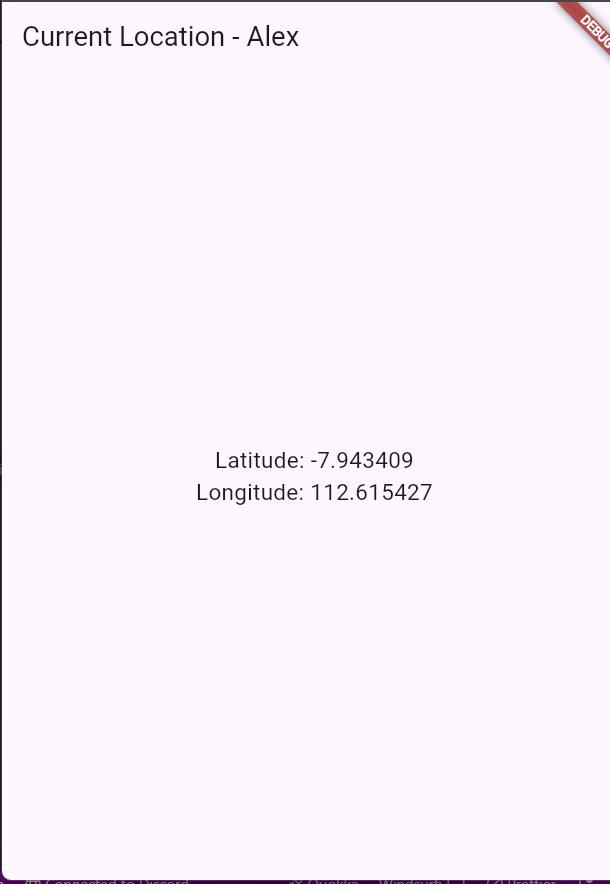

- Langkah 8: Tambahkan animasi loading
    Tambahkan widget loading seperti kode berikut. Lalu hot restart, perhatikan perubahannya.

    ```dart
        @override
        Widget build(BuildContext context) {
        final myWidget = myPosition == ''
            ? const CircularProgressIndicator()
            : const Text(myPosition);;

        return Scaffold(
            appBar: AppBar(title: Text('Current Location')),
            body: Center(child:myWidget),
            );
        }
    ```

    ### Jawaban
    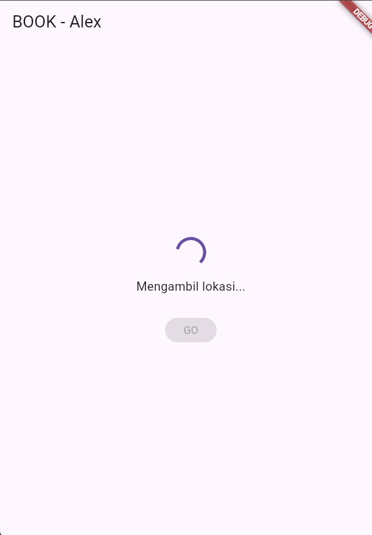 </br>
    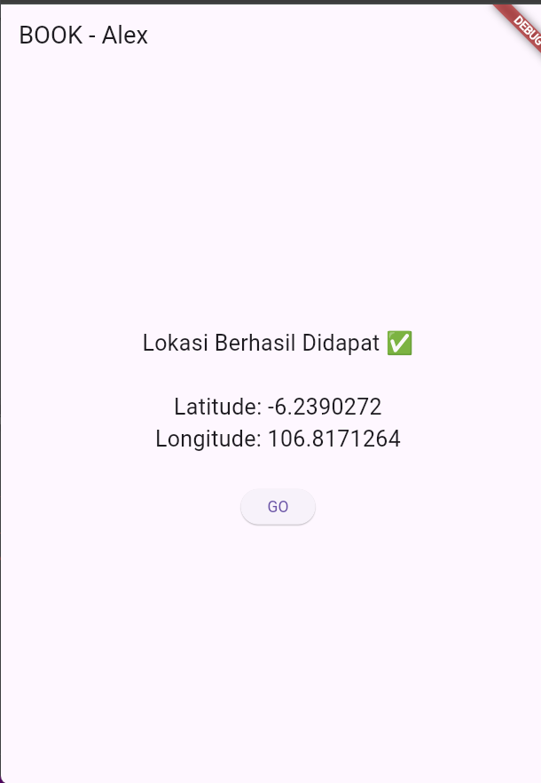

    - Apakah Anda mendapatkan koordinat GPS ketika run di browser? Mengapa demikian?
    - Jawabannya adalah karena browser tidak memiliki layanan lokasi. Jadi, browser hanya dapat menampilkan koordinat GPS yang diberikan oleh server.


### Praktikum 7: Manajemen Future dengan FutureBuilder

- Langkah 1: Modifikasi method getPosition()
    Buka file geolocation.dart kemudian ganti isi method dengan kode ini.

    ```dart
        Future<Position> getPosition() async {
        await Geolocator.isLocationServiceEnabled();
        await Future.delayed(const Duration(seconds: 3));
        Position position = await Geolocator.getCurrentPosition();
        return position; }
    ```

- Langkah 2: Tambah variabel
    Tambah variabel ini di class _LocationScreenState

    ```dart
        Future<Position>? position;
    ```

- Langkah 3: Tambah initState()
    Tambah method ini dan set variabel position

    ```dart
        @override
        void initState() {
        super.initState();
        position = getPosition();
        }
    ```

- Langkah 4: Edit method build()
    Ketik kode berikut dan sesuaikan. Kode lama bisa Anda comment atau hapus.

    ```dart
            @override
        Widget build(BuildContext context) {
        return Scaffold(
            appBar: AppBar(title: Text('Current Location')),
            body: Center(child: FutureBuilder(
            future: position,
            builder: (BuildContext context, AsyncSnapshot<Position>
                snapshot) {
                if (snapshot.connectionState ==
                    ConnectionState.waiting) {
                return const CircularProgressIndicator();
                }
                else if (snapshot.connectionState ==
                    ConnectionState.done) {
                return Text(snapshot.data.toString());
                }
                else {
                return const Text('');
                }
            },
            ),
        ));
        }
    ```

- Langkah 5: Tambah handling error
    Tambahkan kode berikut untuk menangani ketika terjadi error. Kemudian hot restart.

    ```dart
            else if (snapshot.connectionState == ConnectionState.done) {
        if (snapshot.hasError) {
            return Text('Something terrible happened!');
        }
        return Text(snapshot.data.toString());
        }
    ```

    ### Jawaban
    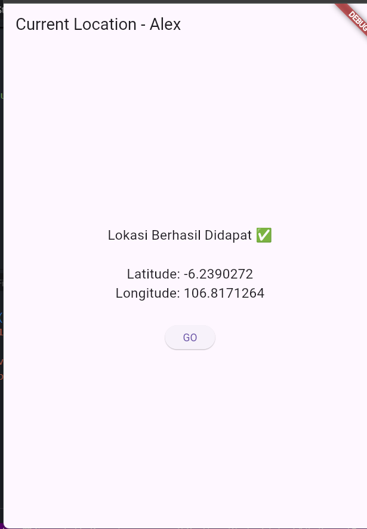

### Praktikum 8: Navigation route dengan Future Function

- Langkah 1: Buat file baru navigation_first.dart
    Buatlah file baru ini di project lib Anda.

- Langkah 2: Isi kode navigation_first.dart
  
    ```dart
        import 'package:flutter/material.dart';

        class NavigationFirst extends StatefulWidget {
        const NavigationFirst({super.key});

        @override
        State<NavigationFirst> createState() => _NavigationFirstState();
        }

        class _NavigationFirstState extends State<NavigationFirst> {
        Color color = Colors.blue.shade700;
        @override
        Widget build(BuildContext context) {
            return Scaffold(
            backgroundColor: color,
            appBar: AppBar(
                title: const Text('Navigation First Screen'),
            ),
            body: Center(
                child: ElevatedButton(
                child: const Text('Change Color'),
                onPressed: () {
                    _navigateAndGetColor(context);
                },
                ),
            ),
            );
        }
        }
    ```

- Langkah 3: Tambah method di class _NavigationFirstState
    Tambahkan method ini.

    ```dart
            Future _navigateAndGetColor(BuildContext context) async {
        color = await Navigator.push(context,
                MaterialPageRoute(builder: (context) => const NavigationSecond()),) ?? Colors.blue;
        setState(() {});
        });
        }
    ```

- Langkah 4: Buat file baru navigation_second.dart
    Buat file baru ini di project lib Anda. Silakan jika ingin mengelompokkan view menjadi satu folder dan sesuaikan impor yang dibutuhkan.

- Langkah 5: Buat class NavigationSecond dengan StatefulWidget
    ```dart
        import 'package.flutter/material.dart';

        class NavigationSecond extends StatefulWidget {
        const NavigationSecond({super.key});

        @override
        State<NavigationSecond> createState() => _NavigationSecondState();
        }

        class _NavigationSecondState extends State<NavigationSecond> {
        @override
        Widget build(BuildContext context) {
            Color color;
            return Scaffold(
            appBar: AppBar(
                title: const Text('Navigation Second Screen'),
            ),
            body: Center(
                child: Column(
                mainAxisAlignment: MainAxisAlignment.spaceEvenly,
                children: [
                    ElevatedButton(
                    child: const Text('Red'),
                    onPressed: () {
                        color = Colors.red.shade700;
                        Navigator.pop(context, color);
                    },
                    ),
                    ElevatedButton(
                    child: const Text('Green'),
                    onPressed: () {
                        color = Colors.green.shade700;
                        Navigator.pop(context, color);
                    },
                    ),
                    ElevatedButton(
                    child: const Text('Blue'),
                    onPressed: () {
                        color = Colors.blue.shade700;
                        Navigator.pop(context, color);
                    },
                    ),
                ],
                ),
            ),
            );
        }
        }
    ```

- Langkah 6: Edit main.dart
    Lakukan edit properti home.

    ```dart
        home: const NavigationFirst(),
    ```

- Langkah 8: Run
    Lakukan run, jika terjadi error silakan diperbaiki.

    ### Jawaban
    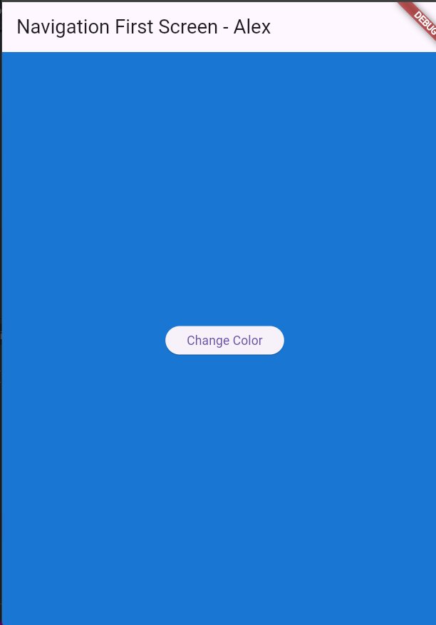 </br>
    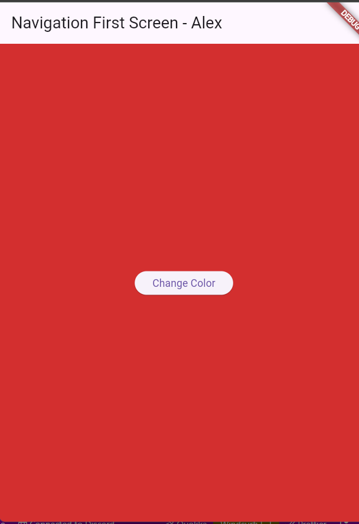 </br>
    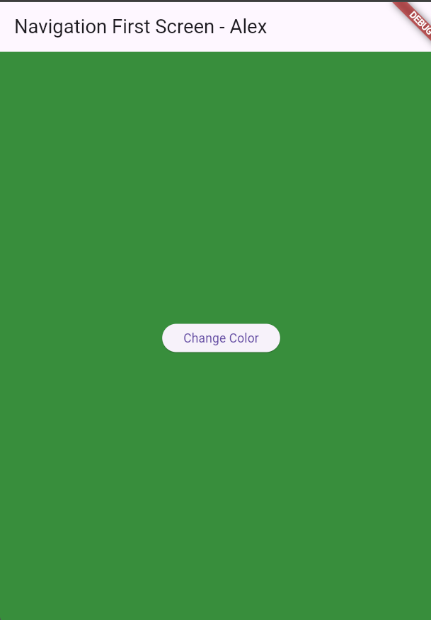


### Praktikum 9: Memanfaatkan async/await dengan Widget Dialog

- Langkah 1: Buat file baru navigation_dialog.dart
    Buat file dart baru di folder lib project Anda.

- Langkah 2: Isi kode navigation_dialog.dart
    ```dart
            import 'package.flutter/material.dart';

        class NavigationDialogScreen extends StatefulWidget {
        const NavigationDialogScreen({super.key});

        @override
        State<NavigationDialogScreen> createState() =>
            _NavigationDialogScreenState();
        }

        class _NavigationDialogScreenState extends State<NavigationDialogScreen> {
        Color color = Colors.blue.shade700;
        @override
        Widget build(BuildContext context) {
            return Scaffold(
            backgroundColor: color,
            appBar: AppBar(
                title: const Text('Navigation Dialog Screen'),
            ),
            body: Center(
                child:
                    ElevatedButton(child: const Text('Change Color'), onPressed: () {}),
            ),
            );
        }
        }
    ```

- Langkah 3: Tambah method async

    ```dart
            _showColorDialog(BuildContext context) async {

        await showDialog(
            barrierDismissible: false,
            context: context,
            builder: (_) {
            return AlertDialog(
                title: const Text('Very important question'),
                content: const Text('Please choose a color'),
                actions: <Widget>[
                TextButton(
                    child: const Text('Red'),
                    onPressed: () {
                    color = Colors.red.shade700;
                    Navigator.pop(context, color);
                    },
                ),
                TextButton(
                    child: const Text('Green'),
                    onPressed: () {
                    color = Colors.green.shade700;
                    Navigator.pop(context, color);
                    },
                ),
                TextButton(
                    child: const Text('Blue'),
                    onPressed: () {
                    color = Colors.blue.shade700;
                    Navigator.pop(context, color);
                    },
                ),
                ],
            );
            },
        );
        setState(() {});
        }
    ```

- Langkah 4: Panggil method di ElevatedButton
    ```dart
        onPressed: () {
        _showColorDialog(context);
        },
    ```

- Langkah 5: Edit main.dart
    Ubah properti home

    ```dart
        home: const NavigationDialog(),
    ```

- Langkah 6: Run
    Coba ganti warna background dengan widget dialog tersebut. Jika terjadi error, silakan diperbaiki. Jika berhasil, akan tampil seperti gambar berikut.

    ### Jawaban
    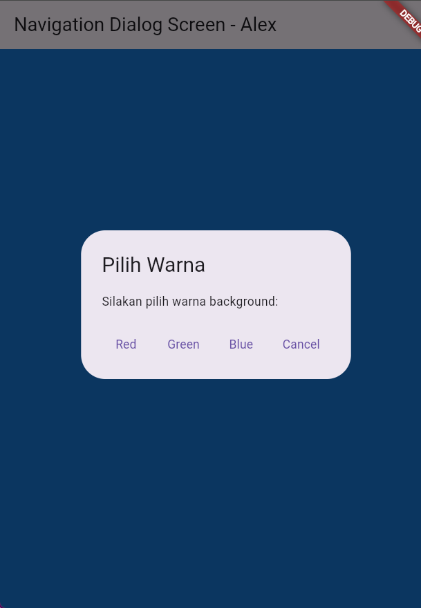 </br>
    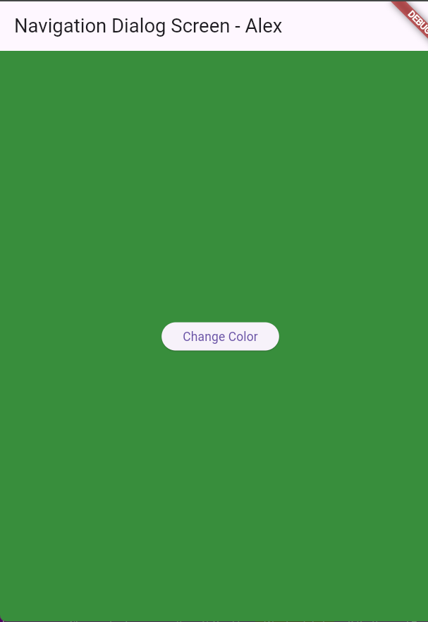 </br>
    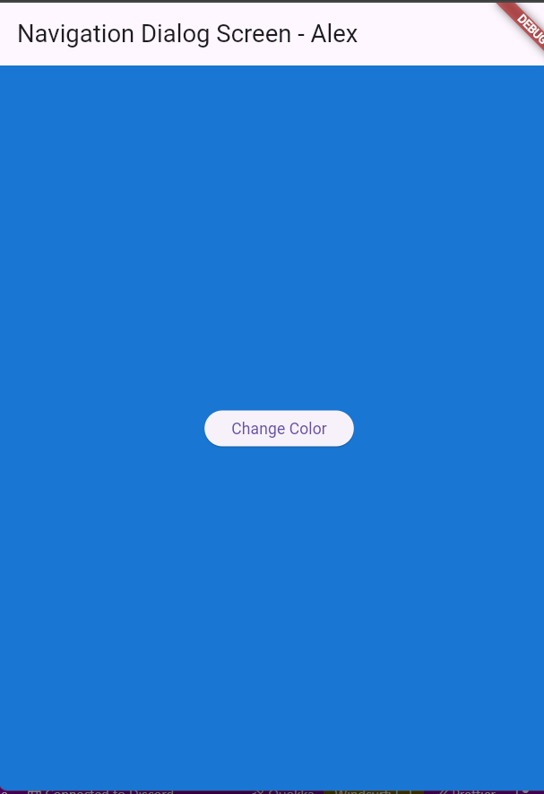

 