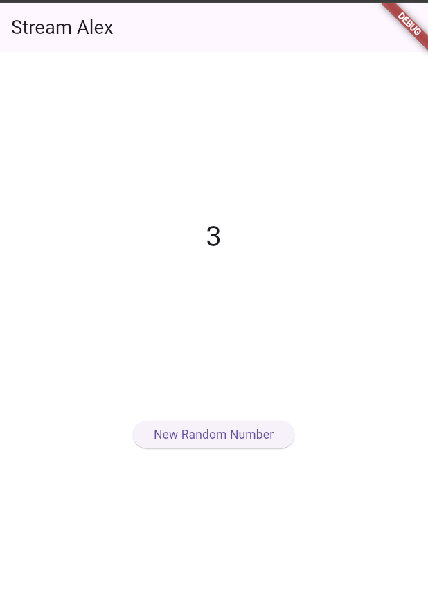
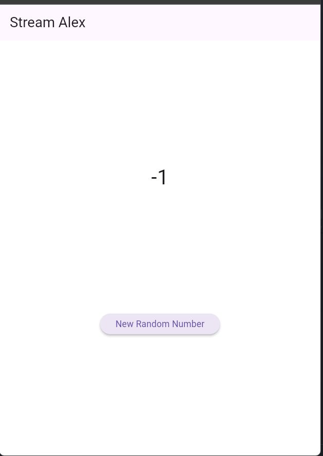
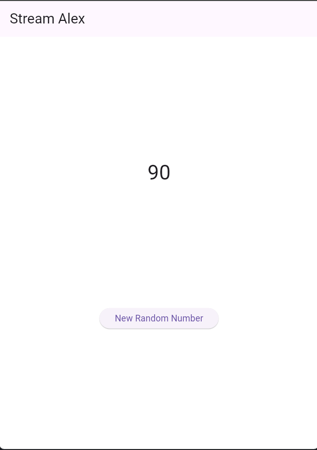
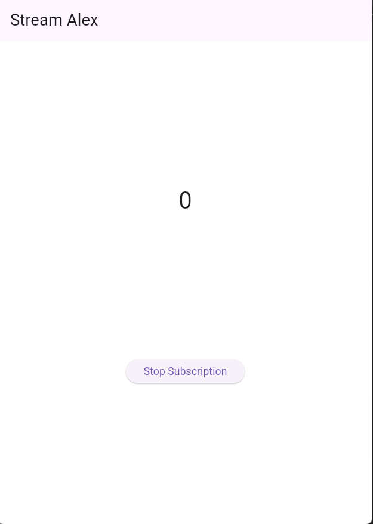
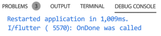
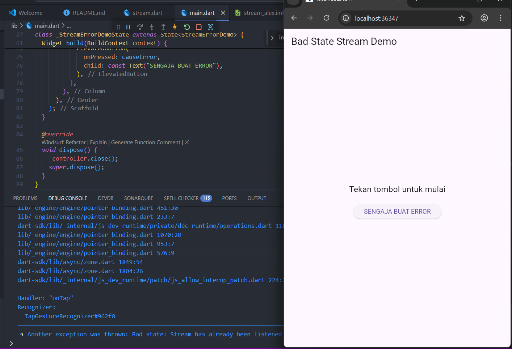
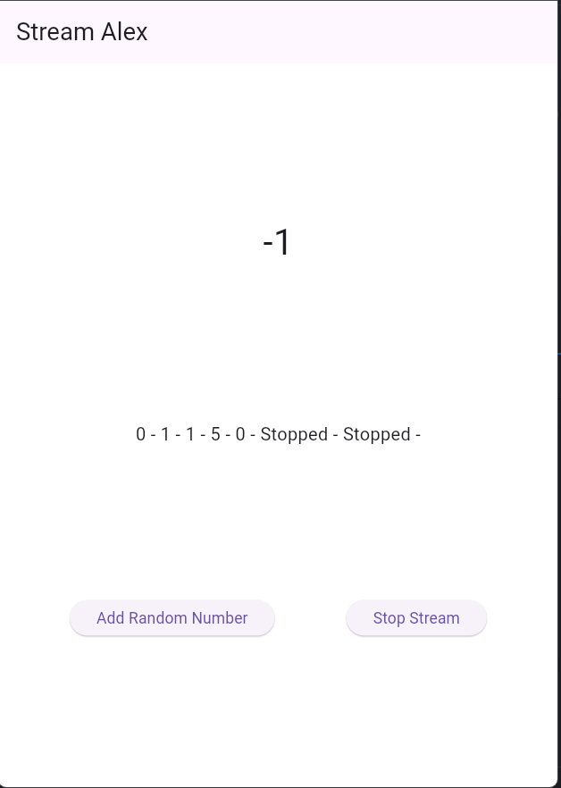
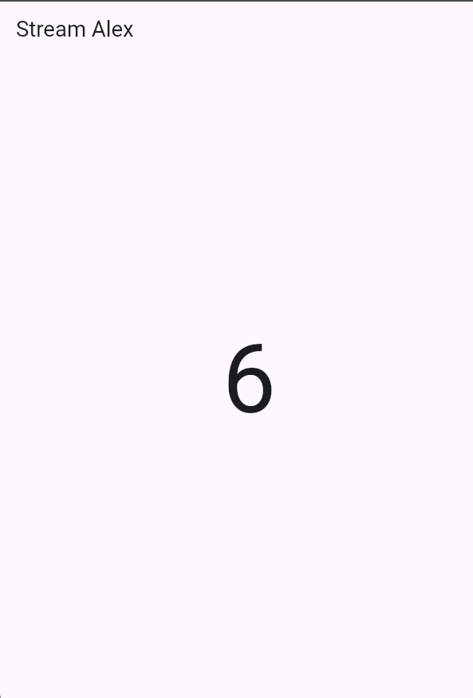
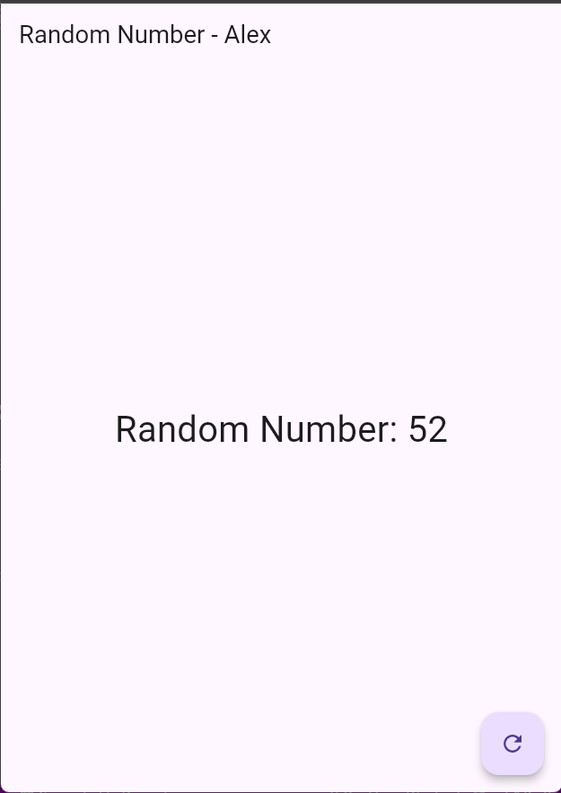

<h1>📱Lanjutan State Management dengan Streams</h1>

| Nama | NIM | Kelas/Absen |
| --- | --- | --- |
| Alexander Agung Raya | 2341720040 | TI-3H / 01 |

### Praktikum 1: Dart Streams

- Langkah 1: Buat Project Baru
    Buatlah sebuah project flutter baru dengan nama stream_nama (beri nama panggilan Anda) di folder week-12/src/ repository GitHub Anda.

- Langkah 2: Buka file main.dart
    Ketiklah kode seperti berikut ini.

    ```dart
        import 'package:flutter/material.dart';

        void main() {
        runApp(const MyApp());
        }

        class MyApp extends StatelessWidget {
        const MyApp({super.key});

        @override
        Widget build(BuildContext context) {
            return MaterialApp(
            title: 'Stream',
            theme: ThemeData(
                primarySwatch: Colors.deepPurple,
            ),
            home: const StreamHomePage(),
            );
        }
        }

        class StreamHomePage extends StatefulWidget {
        const StreamHomePage({super.key});

        @override
        State<StreamHomePage> createState() => _StreamHomePageState();
        }

        class _StreamHomePageState extends State<StreamHomePage> {
        @override
        Widget build(BuildContext context) {
            return Container();
        }
        }
    ```

- Langkah 3: Buat file baru stream.dart
    Buat file baru di folder lib project Anda. Lalu isi dengan kode berikut.
    
    ```dart
        import 'package:flutter/material.dart';

        class ColorsStream {
        
        }
    ```

- Langkah 4: Tambah variabel colors
    Tambahkan variabel di dalam class ColorStream seperti berikut.

    ```dart
        final List<Color> colors = [
            Colors.red,
            Colors.green,
            Colors.blue,
            Colors.yellow,
            Colors.orange,
            Colors.purple,
            Colors.pink,
        ];
    ```

- Langkah 5: Tambah method getColors()
    Di dalam class ColorStream ketik method seperti kode berikut. Perhatikan tanda bintang di akhir keyword async* (ini digunakan untuk melakukan Stream data)

    ```dart
        Stream<Color> getColors() async* {
      
        }
    ```

- Langkah 6: Tambah perintah yield*
    Tambahkan kode berikut ini.

    ```dart
        yield* Stream.periodic(
            const Duration(seconds: 1), (int t) {
            int index = t % colors.length;
            return colors[index];
        });
    ```
    Jelaskan fungsi keyword yield* pada kode tersebut!

    - Keyword yield* digunakan untuk mengembalikan Stream data yang berisi daftar Color yang dihasilkan dari method getColors()
  
- Langkah 7: Buka main.dart
    Ketik kode impor file ini pada file main.dart

    ```dart
        import 'stream.dart';
    ```

- Langkah 8: Tambah variabel
    Ketik dua properti ini di dalam class _StreamHomePageState

    ```dart
        Color bgColor = Colors.white;
        late ColorsStream colorsStream;
    ```

- Langkah 9: Tambah method changeColor()
    Tetap di file main, Ketik kode seperti berikut

    ```dart 
            void changeColor() async {
        await for (var eventColor in colorsStream.getColors()) {
            setState(() {
            bgColor = eventColor;
            });
        }
        }
    ```

- Langkah 10: Lakukan override initState()
    Ketika kode seperti berikut

    ```dart
        @override
        void initState() {
            super.initState();
            colorsStream = ColorsStream();
            changeColor();
        }
    ```

- Langkah 11: Ubah isi Scaffold()
    Sesuaikan kode seperti berikut.

    ```dart
        return Scaffold(
            appBar: AppBar(
                title: const Text('Stream Alex'),
            ),
            body: Container(
                decoration: BoxDecoration(color: bgColor),
            )),
        ;
    ```

- Langkah 12: Run
    Lakukan running pada aplikasi Flutter Anda, maka akan terlihat berubah warna background setiap detik.

    

- Langkah 13: Ganti isi method changeColor()
    Anda boleh comment atau hapus kode sebelumnya, lalu ketika kode seperti berikut.

    ```dart
            void _changeColor() async {
            colorsStream.getColors().listen((eventColor) {
            setState(() {
                bgColor = eventColor;
            });
            });
            // await for (var eventColor in colorsStream.getColors()) {
            //   setState(() {
            //     bgColor = eventColor;
            //   });
            // }
        }
    ```

  Jelaskan perbedaan menggunakan listen dan await for (langkah 9) !

   - Listen digunakan untuk menerima Stream data, dan await for digunakan untuk menerima Stream data yang berisi daftar Color.

### Praktikum 2: Stream controllers dan sinks

- Langkah 1: Buka file stream.dart
    Lakukan impor dengan mengetik kode ini.

    ```dart
        import 'dart:async';
    ```

- Langkah 2: Tambah class NumberStream
    Tetap di file stream.dart tambah class baru seperti berikut.

    ```dart
        class NumberStream {
        
        }
    ```

- Langkah 3: Tambah StreamController
    Di dalam class NumberStream buatlah variabel seperti berikut.

    ```dart
         final StreamController<int> controller = StreamController<int>();
        ```
  
- Langkah 4: Tambah method addNumberToSink
    Tetap di class NumberStream buatlah method ini

    ```dart
        void addNumberToSink(int newNumber) {
        controller.sink.add(newNumber);
        }
    ```

- Langkah 5: Tambah method close()
    ```dart
        close() {
            controller.close();
        }
    ```

- Langkah 6: Buka main.dart
    Ketik kode import seperti berikut

    ```dart
        import 'dart:async';
        import 'dart:math';
    ```

- Langkah 7: Tambah variabel
    Di dalam class _StreamHomePageState ketik variabel berikut

    ```dart
        int lastNumber = 0;
        late StreamController NumberStreamController;
        late NumberStream numberStream;
    ```

- Langkah 8: Edit initState()

    ```dart
        void initState() {

            numberStream = NumberStream();
            NumberStreamController = numberStream.  controller;
            Stream stream = NumberStreamController.stream;
            stream.listen((event) {
            setState(() {
            lastNumber = event;
            });
            });
            super.initState();
            // colorsStream = ColorsStream();
            // _changeColor();
        }
    ```

- Langkah 9: Edit dispose()
    ```dart
        @override
        void dispose() {
            NumberStreamController.close();
            super.dispose();
        }
    ```

- Langkah 10: Tambah method addRandomNumber()

    ```dart
        void addRandomNumber() {
            Random random = Random();
            int myNum = random.nextInt(10);
            numberStream.addNumberToSink(myNum);
        }
    ```

- Langkah 11: Edit method build()
    ```dart
            body: SizedBox (
        width: double.infinity,
        child: Column(
            mainAxisAlignment: MainAxisAlignment.spaceEvenly,
            crossAxisAlignment: CrossAxisAlignment.center,
            children: [
            Text(lastNumber.toString()),
            ElevatedButton(
                onPressed: () => addRandomNumber(),
                child: Text('New Random Number'),
            )
            ],
        ),
        )
    ```

- Langkah 12: Run
    Lakukan running pada aplikasi Flutter Anda, maka akan terlihat seperti gambar berikut.

     </br>

    Jelaskan maksud kode langkah 8 dan 10 tersebut!

    - Langkah 8: Di dalam initState() kita membuat variabel NumberStreamController, dan mengaturnya dengan variabel numberStream. Kemudian kita menggunakan method stream.listen() untuk menerima Stream data.

    - Langkah 10: Di dalam method addRandomNumber() kita membuat variabel Random dan mengaturnya dengan variabel myNum. Kemudian kita menggunakan method numberStream.addNumberToSink() untuk menambahkan Stream data.

- Langkah 13: Buka stream.dart
    Tambahkan method berikut ini.

    ```dart
        void addError() {
            controller.sink.addError("This is an error");
        }
    ```

- Langkah 14: Buka main.dart
    Tambahkan method onError di dalam class StreamHomePageState pada method listen di fungsi initState() seperti berikut ini.

    ```dart
        stream.listen((event) {
            setState(() {
            lastNumber = event;
            });
        }, onError: (error) {
            setState(() {
            lastNumber = -1;
        });
    ```

- Langkah 15: Edit method addRandomNumber()
  Lakukan comment pada dua baris kode berikut, lalu ketik kode seperti berikut ini.

    ```dart
        void addRandomNumber() {
            Random random = Random();
            numberStream.addError();
        }
    ```

    ### Jawban 
    

    Jelaskan maksud kode langkah 13 sampai 15 tersebut!
    - Langkah 13: Di dalam method addRandomNumber() kita membuat variabel Random dan mengaturnya dengan variabel myNum. Kemudian kita menggunakan method numberStream.addNumberToSink() untuk menambahkan Stream data.
    - Langkah 14: Di dalam method addRandomNumber() kita menggunakan method numberStream.addError() untuk menambahkan Stream error.
    - Langkah 15: Di dalam method addRandomNumber() kita menggunakan method numberStream.addError() untuk menambahkan Stream error.


### Praktikum 3: Injeksi data ke streams

- Langkah 1: Buka main.dart
    Tambahkan variabel baru di dalam class _StreamHomePageState

    ```dart
        late StreamTransformer transformer;
    ```

- Langkah 2: Tambahkan kode ini di initState

    ```dart
        transformer = StreamTransformer<int, int>.fromHandlers(
        handleData: (value, sink) {
        sink.add(value * 10);
        },
        handleError: (error, trace, sink) {
        sink.add(-1);
        },
        handleDone: (sink) => sink.close());
    ```

- Langkah 3: Tetap di initState
    Lakukan edit seperti kode berikut.

    ```dart
        stream.transform(transformer).listen((event) {
        setState(() {
            lastNumber = event;
        });
        }).onError((error) {
        setState(() {
            lastNumber = -1;
        });
        });
        super.initState();
    ```

- Langkah 4: Run
    Terakhir, run atau tekan F5 untuk melihat hasilnya jika memang belum running. Bisa juga lakukan hot restart jika aplikasi sudah running. Maka hasilnya akan seperti gambar berikut ini. Anda akan melihat tampilan angka dari 0 hingga 90.

    ### Jawban
    

    Jelaskan maksud kode langkah 1-3 tersebut!
    - Langkah 1: Di dalam initState() kita membuat variabel StreamTransformer dan mengaturnya dengan kode berikut.
    - Langkah 2: Di dalam initState() kita menggunakan method stream.transform() untuk menambahkan StreamTransformer ke Stream data.
    - Langkah 3: Di dalam initState() kita menggunakan method stream.transform() untuk menambahkan StreamTransformer ke Stream data.
  

### Praktikum 4: Subscribe ke stream events

- Langkah 1: Tambah variabel
    Tambahkan variabel berikut di class _StreamHomePageState

    ```dart
        late StreamSubscription<int> subscription;
    ```

- Langkah 2: Edit initState()
    Edit kode seperti berikut ini.

    ```dart
            @override
        void initState() {
        numberStream = NumberStream();
        numberStreamController = numberStream.controller;
        Stream stream = numberStreamController.stream;
        subscription = stream.listen((event) {
            setState(() {
            lastNumber = event;
            });
        });
        super.initState();
        }
    ```

- Langkah 3: Tetap di initState()
    Tambahkan kode berikut ini.

    ```dart
    subscription.onError((error)) {
        setState(() {
            lastNumber = -1;
        });
    }

- Langkah 4: Tambah properti onDone()
    Tambahkan dibawahnya kode ini setelah onError

    ```dart
    subscription.onDone(() {
        print("Done");
        });
    }    
    ```

- Langkah 5: Tambah method baru
    Ketik method ini di dalam class _StreamHomePageState

    ```dart
        void StopStream() {
            NumberStreamController.close();
        }
    ```

- Langkah 6: Pindah ke method dispose()
    Jika method dispose() belum ada, Anda dapat mengetiknya dan dibuat override. Ketik kode ini didalamnya.

    ```dart
        subscription.cancel();
    ```

- Langkah 7: Pindah ke method build()
    Tambahkan button kedua dengan isi kode seperti berikut ini.

    ```dart
            ElevatedButton(
                onPressed: () => StopStream(),
                child: Text('Stop Subscription'),
            )
    ```

- Langkah 8: Edit method addRandomNumber()
    Edit kode seperti berikut ini.

    ```dart
            void addRandomNumber() {
        Random random = Random();
        int myNum = random.nextInt(10);
        if (!numberStreamController.isClosed) {
            numberStream.addNumberToSink(myNum);
        } else {
            setState(() {
            lastNumber = -1;
            });
        }
        }
    ```

- Langkah 9: Run
    Lakukan run atau tekan F5 untuk melihat hasilnya.
    

- Langkah 10: Tekan button ‘Stop Subscription'
    Anda akan melihat pesan di Debug Console seperti berikut.

    

    Jelaskan maksud kode langkah 6 sampai 8 tersebut!
    - Langkah 6: Di dalam initState() kita menggunakan method subscription.cancel() untuk membatalkan subscription.
    - Langkah 7: Di dalam initState() kita menggunakan method subscription.cancel() untuk membatalkan subscription.
    - Langkah 8: Di dalam initState() kita menggunakan method numberStreamController.isClosed untuk mengecek apakah Stream data sudah dikeluarkan atau tidak.

### Praktikum 5: Multiple stream subscriptions

- Langkah 1: Buka file main.dart
    Tambahkan variabel berikut di dalam class _StreamHomePageState

    ```dart
        late StreamSubscription<int> subscription1;
        String Value1 = '';
    ```

- Langkah 2: Edit initState()
    Ketik kode seperti berikut.

    ```dart
            subscription = stream.listen((event) {
        setState(() {
            values += '$event - ';
        });
        });

        subscription2 = stream.listen((event) {
        setState(() {
            values += '$event - ';
        });
        });
    ```

- Langkah 3: Run
    Lakukan run maka akan tampil error seperti gambar berikut.

    

    Jelaskan mengapa error itu bisa terjadi ?

    - Langkah 3: Di dalam initState() kita menggunakan method stream.listen() untuk menerima Stream data.

- Langkah 4: Set broadcast stream
    Ketik kode seperti berikut di method initState()

    ```dart
            void initState() {
        numberStream = NumberStream();
        numberStreamController = numberStream.controller;
        Stream stream = numberStreamController.stream.
        asBroadcastStream();
        ...
        }
    ```

- Langkah 5: Edit method build()
    Edit kode seperti berikut ini.

    ```dart
            child: Column(
        mainAxisAlignment: MainAxisAlignment.spaceEvenly,
        crossAxisAlignment: CrossAxisAlignment.center,
        children: [
            Text(values),
    ```

- Langkah 6: Run
    Tekan button ‘New Random Number' beberapa kali, maka akan tampil teks angka terus bertambah sebanyak dua kali.

    

    Jelaskan mengapa hal itu bisa terjadi ?
    - Langkah 6: Di dalam initState() kita menggunakan method stream.asBroadcastStream() untuk mengubah Stream data menjadi Stream broadcast.

### Praktikum 6: StreamBuilder

- Langkah 1: Buat Project Baru
    Buatlah sebuah project flutter baru dengan nama streambuilder_nama (beri nama panggilan Anda) di folder week-12/src/ repository GitHub Anda.

- Langkah 2: Buat file baru stream.dart
    Ketik kode ini

    ```dart
        class NumberStream {}
    ```

- Langkah 3: Tetap di file stream.dart

    ```dart
            import 'dart:math';

        class NumberStream {
        Stream<int> getNumbers() async* {
            yield* Stream.periodic(const Duration(seconds: 1), (int t) {
            Random random = Random();
            int myNum = random.nextInt(10);
            return myNum;
            });
        }
        }
    ```

- Langkah 4: Edit main.dart
    Ketik kode seperti berikut ini.

    ```dart
        import 'package:flutter/material.dart';
        import 'stream.dart';
        import 'dart:async';

        void main() {
        runApp(const MyApp());
        }

        class MyApp extends StatelessWidget {
        const MyApp({super.key});

        @override
        Widget build(BuildContext context) {
            return MaterialApp(
            title: 'Stream',
            theme: ThemeData(
                primarySwatch: Colors.deepPurple,
            ),
            home: const StreamHomePage(),
            );
        }
        }

        class StreamHomePage extends StatefulWidget {
        const StreamHomePage({super.key});

        @override
        State<StreamHomePage> createState() => _StreamHomePageState();
        }

        class _StreamHomePageState extends State<StreamHomePage> {
        @override
        Widget build(BuildContext context) {
            return Scaffold(
            appBar: AppBar(
                title: const Text('Stream'),
            ),
            body: Container(
            ),
            );
        }
        }
    ```

- Langkah 6: Edit initState()
    Ketik kode seperti berikut ini.

    ```dart
            @override
        void initState() {
        numberStream = NumberStream().getNumbers();
        super.initState();
        }
    ```

- Langkah 7: Edit method build()

    ```dart
            body: StreamBuilder(
        stream: numberStream,
        initialData: 0,
        builder: (context, snapshot) {
            if (snapshot.hasError) {
            print('Error!');
            }
            if (snapshot.hasData) {
            return Center(
                child: Text(
                snapshot.data.toString(),
                style: const TextStyle(fontSize: 96),
                ),
            );
            } else {
            return const SizedBox.shrink();
            }
        },
        ),
    ```

- Langkah 8: Run

    

    Jelaskan maksud kode pada langkah 3 dan 7 !

    - Langkah 3: Di dalam class NumberStream kita membuat method getNumbers() yang mengembalikan Stream data.
    - Langkah 7: Di dalam method build() kita menggunakan method snapshot.data untuk menampilkan data Stream.

### Praktikum 7: BLoC Pattern

- Langkah 1: Buat Project baru
    Buatlah sebuah project flutter baru dengan nama bloc_random_nama (beri nama panggilan Anda) di folder week-12/src/ repository GitHub Anda. Lalu buat file baru di folder lib dengan nama random_bloc.dart

- Langkah 2: Isi kode random_bloc.dart
    Ketik kode impor berikut ini.

    ```dart
        import 'package:flutter/material.dart';
        import 'dart:async';
        import 'dart:math';
    ```

- Langkah 3: Buat class RandomNumberBloc()
    
    ```dart
        class RandomNumberBloc {}
    ```

- Langkah 4: Buat variabel StreamController
   Di dalam class RandomNumberBloc() ketik variabel berikut ini

    ```dart
        // StreamController for input events
        final _generateRandomController = StreamController<void>();
        // StreamController for output
        final _randomNumberController = StreamController<int>();
        // Input Sink
        Sink<void> get generateRandom => _generateRandomController.sink;
        // Output Stream.
        Stream<int> get randomNumber => _randomNumberController.stream;
        _secondsStreamController.sink;
    ```

- Langkah 5: Buat constructor

    ```dart
            RandomNumberBloc() {
        _generateRandomController.stream.listen((_) {
            final random = Random().nextInt(10);
            _randomNumberController.sink.add(random);
        });
        }
    ```

- Langkah 6: Buat method dispose()

    ```dart
            void dispose() {
        _generateRandomController.close();
        _randomNumberController.close();
        }
    ```

- Langkah 7: Edit main.dart

    ```dart
            class MyApp extends StatelessWidget {
        const MyApp({super.key});

        @override
        Widget build(BuildContext context) {
            return MaterialApp(
            title: 'Flutter Demo',
            theme: ThemeData(
                primarySwatch: Colors.blue,
            ),
            home: const RandomScreen(),
            );
        }
        }
    ```

- Langkah 8: Buat file baru random_screen.dart
    Di dalam folder lib project Anda, buatlah file baru ini.

- Langkah 9: Lakukan impor material dan random_bloc.dart
    Ketik kode ini di file baru random_screen.dart

    ```dart
        import 'package:flutter/material.dart';
        import 'random_bloc.dart';
    ```

- Langkah 10: Buat StatefulWidget RandomScreen
    Buatlah di dalam file random_screen.dart

- Langkah 11: Buat variabel
    Ketik kode ini di dalam class _RandomScreenState

    ```dart
        final _bloc = RandomNumberBloc();
    ```

- Langkah 12: Buat method dispose()
    Ketik kode ini di dalam class _StreamHomePageState

    ```dart
        @override
        void dispose() {
        _bloc.dispose();
        super.dispose();
        }   
    ```

- Langkah 13: Edit method build()

    ```dart
            @override
        Widget build(BuildContext context) {
        return Scaffold(
            appBar: AppBar(title: const Text('Random Number')),
            body: Center(
            child: StreamBuilder<int>(
                stream: _bloc.randomNumber,
                initialData: 0,
                builder: (context, snapshot) {
                return Text(
                    'Random Number: ${snapshot.data}',
                    style: const TextStyle(fontSize: 24),
                );
                },
            ),
            ),
            floatingActionButton: FloatingActionButton(
            onPressed: () => _bloc.generateRandom.add(null),
            child: const Icon(Icons.refresh),
            ),
        );
        }
    ```

    

    Jelaskan maksud praktikum ini ! Dimanakah letak konsep pola BLoC-nya ?
    - Langkah 13: Di dalam method build() kita menggunakan method snapshot.data untuk menampilkan data Stream.
  