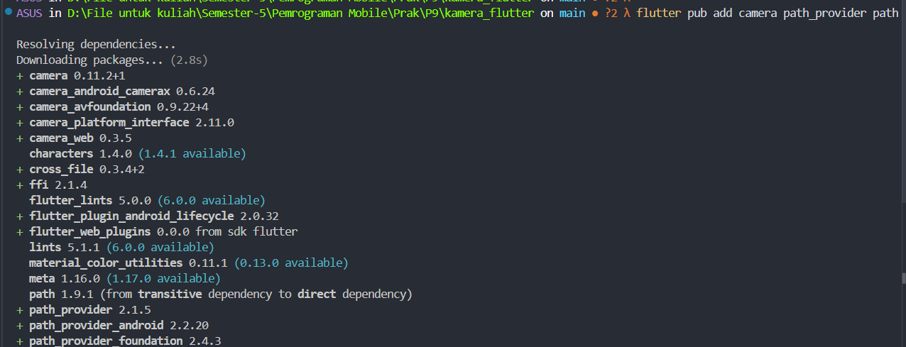
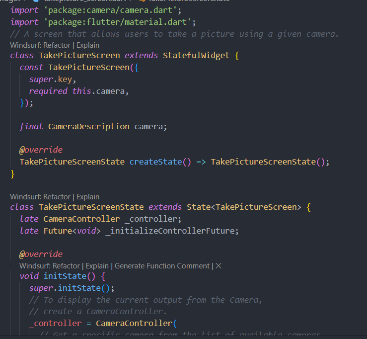
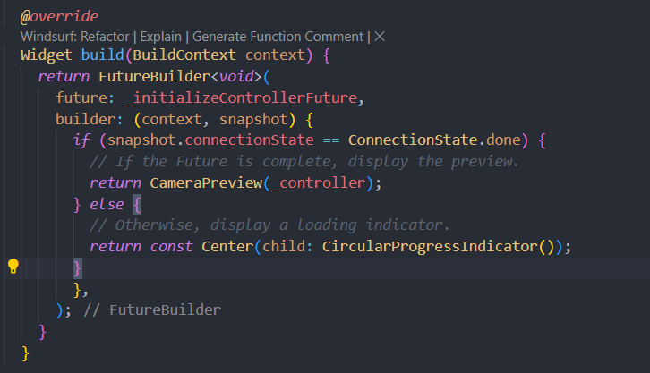
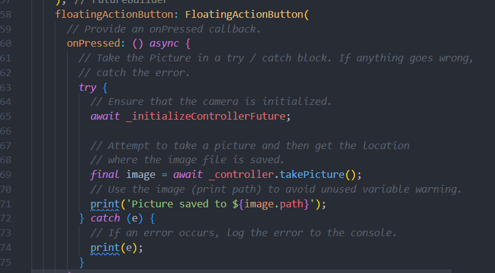
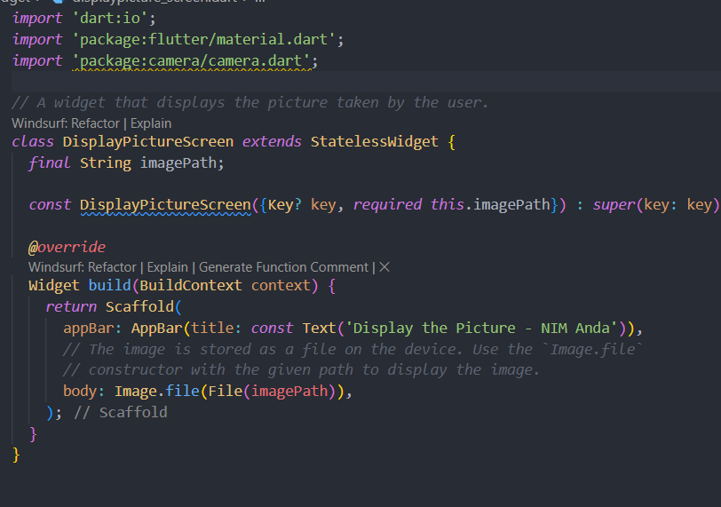
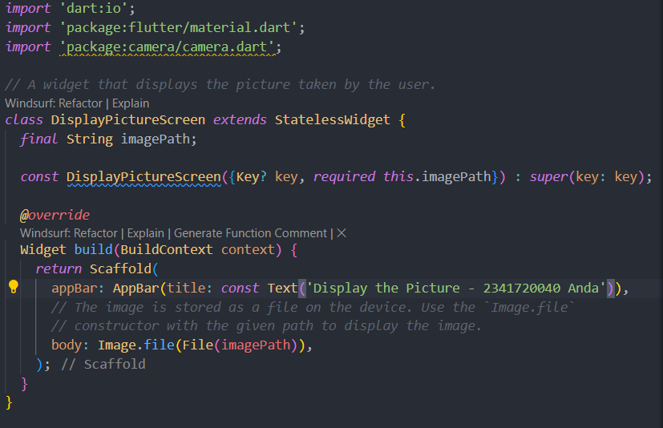
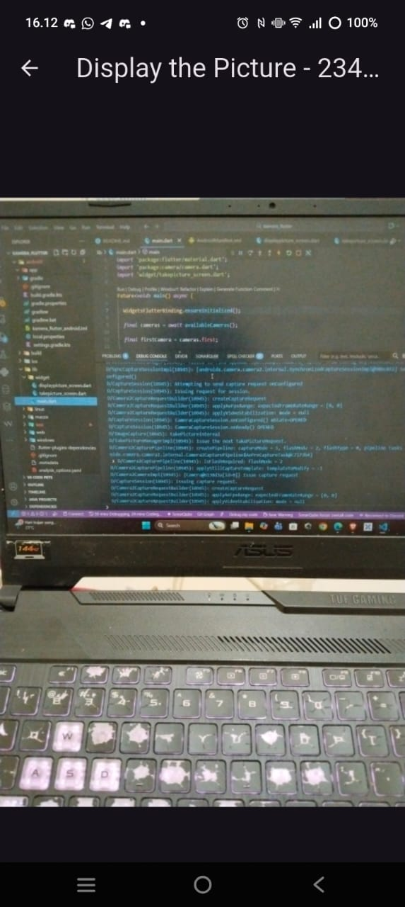
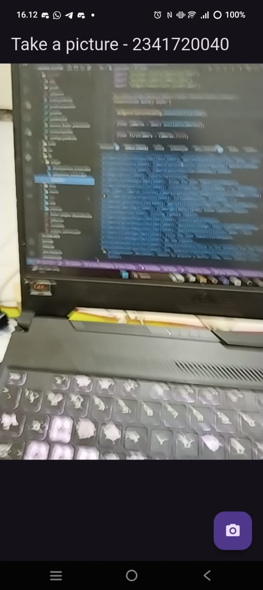

<h1>📱Kamera</h1>

| Nama | NIM | Kelas/Absen |
| --- | --- | --- |
| Alexander Agung Raya | 2341720040 | TI-3H / 01 |

##  Praktikum 1: Mengambil Foto dengan Kamera di Flutter

- Langkah 1: Buat Project Baru
    Buatlah sebuah project flutter baru dengan nama `kamera_flutter`, lalu sesuaikan style laporan praktikum yang Anda buat.

- Langkah 2: Tambah dependensi yang diperlukan
    Anda memerlukan tiga dependensi pada project flutter untuk menyelesaikan praktikum ini.

    `camera` → menyediakan seperangkat alat untuk bekerja dengan kamera pada device.

    `path_provider` → menyediakan lokasi atau path untuk menyimpan hasil foto.

    `path` → membuat path untuk mendukung berbagai platform.

    Untuk menambahkan dependensi plugin, jalankan perintah `flutter pub add` seperti berikut di terminal: </br>

    ```bash
        flutter pub add camera path_provider path
    ```

    > [!Tips]
    > Untuk Android, Anda harus update variabel minSdkVersion = 21 (atau lebih tinggi) pada file gradle.
    > Pada iOS, baris kode berikut harus ditambahkan pada file ios/Runner/Info.plist untuk mengakses kamera dan microphone.
    </br>

    ```dart
        <key>NSCameraUsageDescription</key>
        <string>Explanation on why the camera access is needed.</string>
        <key>NSMicrophoneUsageDescription</key>
        <string>Explanation on why the microphone access is needed.</string>
    ```

     

- Langkah 3: Ambil Sensor Kamera dari device
    Selanjutnya, kita perlu mengecek jumlah kamera yang tersedia pada perangkat menggunakan plugin camera seperti pada kode berikut ini. Kode ini letakkan dalam void main().

    lib/main.dart </br>

  ```dart
    // Ensure that plugin services are initialized so that `availableCameras()`
    // can be called before `runApp()`
    WidgetsFlutterBinding.ensureInitialized();

    // Obtain a list of the available cameras on the device.
    final cameras = await availableCameras();

    // Get a specific camera from the list of available cameras.
    final firstCamera = cameras.first;
    }
  ```
  
  ### Jawaban
  

- Langkah 4: Buat dan inisialisasi `CameraController`
    etelah Anda dapat mengakses kamera, gunakan langkah-langkah berikut untuk membuat dan menginisialisasi `CameraController`. Pada langkah berikut ini, Anda akan membuat koneksi ke kamera perangkat yang memungkinkan Anda untuk mengontrol kamera dan menampilkan pratinjau umpan kamera.

    Buat `StatefulWidget` dengan kelas `State` pendamping.
    Tambahkan variabel ke kelas `State` untuk menyimpan `CameraController`.
    Tambahkan variabel ke kelas `State` untuk menyimpan Future yang dikembalikan dari `CameraController.initialize()`.
    Buat dan inisialisasi controller dalam metode `initState()`.
    Hapus controller dalam metode `dispose()`. </br>

    `lib/widget/takepicture_screen.dart`

  ```dart
      // A screen that allows users to take a picture using a given camera.
        class TakePictureScreen extends StatefulWidget {
        const TakePictureScreen({
        super.key,
        required this.camera,
    });

        final CameraDescription camera;

        @override
        TakePictureScreenState createState() => TakePictureScreenState();
        }

    class TakePictureScreenState extends State<TakePictureScreen> {
    late CameraController _controller;
    late Future<void> _initializeControllerFuture;

    @override
    void initState() {
        super.initState();
        // To display the current output from the Camera,
        // create a CameraController.
        _controller = CameraController(
        // Get a specific camera from the list of available cameras.
        widget.camera,
        // Define the resolution to use.
        ResolutionPreset.medium,
        );

        // Next, initialize the controller. This returns a Future.
        _initializeControllerFuture = _controller.initialize();
    }

    @override
    void dispose() {
        // Dispose of the controller when the widget is disposed.
        _controller.dispose();
        super.dispose();
    }

    @override
    Widget build(BuildContext context) {
        // Fill this out in the next steps.
        return Container();
    }
    }
    ```
  
  >[!Warning]
  > Jika Anda tidak menginisialisasi `CameraController`, Anda tidak dapat menggunakan kamera untuk menampilkan pratinjau dan mengambil gambar.

  ### Jawaban
  

- Langkah 5: Gunakan `CameraPreview` untuk menampilkan preview foto
    Gunakan widget `CameraPreview` dari package camera untuk menampilkan preview foto. Anda perlu tipe objek void berupa FutureBuilder untuk menangani proses async. </br>

    >[!Note]
    > Pada kode ini Anda perlu logic untuk menunggu controller selesai proses inisialisasi sebelum bekerja dengan kamera. Anda harus menunggu hasil dari method `_initializeControllerFuture()`, yang telah dibuat sebelumnya, agar dapat menampilkan preview foto dengan CameraPreview.

    lib/widget/takepicture_screen.dart

    ```dart
        @override
        Widget build(BuildContext context) {
        return Scaffold(
        appBar: AppBar(title: const Text('Take a picture - NIM Anda')),
        // You must wait until the controller is initialized before displaying the
        // camera preview. Use a FutureBuilder to display a loading spinner until the
        // controller has finished initializing.
        body: FutureBuilder<void>(
            future: _initializeControllerFuture,
            builder: (context, snapshot) {
            if (snapshot.connectionState == ConnectionState.done) {
                // If the Future is complete, display the preview.
                return CameraPreview(_controller);
            } else {
                // Otherwise, display a loading indicator.
                return const Center(child: CircularProgressIndicator());
            }
            },
        ),
    ```
    ### Jawaban
    

- Langkah 6: Ambil foto dengan CameraController
    Anda dapat menggunakan `CameraController` untuk mengambil gambar menggunakan metode takePicture(), yang mengembalikan objek `XFile`, merupakan sebuah objek abstraksi File lintas platform yang disederhanakan. Pada Android dan iOS, gambar baru disimpan dalam direktori cache masing-masing, dan `path` ke lokasi tersebut dikembalikan dalam `XFile`.

    Pada codelab ini, buatlah sebuah `FloatingActionButton` yang digunakan untuk mengambil gambar menggunakan CameraController saat pengguna mengetuk tombol.

    Pengambilan gambar memerlukan 2 langkah:

    Pastikan kamera telah diinisialisasi.
    Gunakan controller untuk mengambil gambar dan pastikan ia mengembalikan objek `Future`.
    Praktik baik untuk membungkus operasi kode ini dalam blok `try / catch` guna menangani berbagai kesalahan yang mungkin terjadi.

    Kode berikut letakkan dalam `Widget build` setelah field `body`.

    lib/widget/takepicture_screen.dart

    ```dart
        FloatingActionButton(
        // Provide an onPressed callback.
        onPressed: () async {
            // Take the Picture in a try / catch block. If anything goes wrong,
            // catch the error.
            try {
            // Ensure that the camera is initialized.
            await _initializeControllerFuture;

            // Attempt to take a picture and then get the location
            // where the image file is saved.
            final image = await _controller.takePicture();
            } catch (e) {
            // If an error occurs, log the error to the console.
            print(e);
            }
        },
        child: const Icon(Icons.camera_alt),
        )
    ```

    ### Jawaban
    

- Langkah 7: Buat widget baru DisplayPictureScreen
    Buatlah file baru pada folder widget yang berisi kode berikut.
    lib/widget/displaypicture_screen.dart

    ```dart
        // A widget that displays the picture taken by the user.
    class DisplayPictureScreen extends StatelessWidget {
    final String imagePath;

    const DisplayPictureScreen({super.key, required this.imagePath});

    @override
    Widget build(BuildContext context) {
        return Scaffold(
        appBar: AppBar(title: const Text('Display the Picture - NIM Anda')),
        // The image is stored as a file on the device. Use the `Image.file`
        // constructor with the given path to display the image.
        body: Image.file(File(imagePath)),
        );
    }
    }
    ```

    ### Jawaban
    

- Langkah 8: Edit main.dart
    Edit pada file ini bagian runApp seperti kode berikut.

    lib/main.dart

    ```dart
        runApp(
            MaterialApp(
            theme: ThemeData.dark(),
            home: TakePictureScreen(
                // Pass the appropriate camera to the TakePictureScreen widget.
                camera: firstCamera,
            )
            debugShowCheckedModeBanner: false,
            ),
        );
    ```

    ### Jawaban
    

- Langkah 9: Menampilkan hasil foto
    Tambahkan kode seperti berikut pada bagian try / catch agar dapat menampilkan hasil foto pada DisplayPictureScreen.

    lib/widget/takepicture_screen.dart

    ```dart
        // Take the Picture in a try / catch block. If anything goes wrong,
          // catch the error.
          try {
            // Ensure that the camera is initialized.
            await _initializeControllerFuture;

            // Attempt to take a picture and get the file `image`
            // where it was saved.
            final image = await _controller.takePicture();

            if (!context.mounted) return;

            // If the picture was taken, display it on a new screen.
            await Navigator.of(context).push(
              MaterialPageRoute(
                builder: (context) => DisplayPictureScreen(
                  // Pass the automatically generated path to
                  // the DisplayPictureScreen widget.
                  imagePath: image.path,
                ),
              ),
            );
          } catch (e) {
            // If an error occurs, log the error to the console.
            print(e);
          }
    ```

    ### Jawaban
    

    ### Hasil
    
    